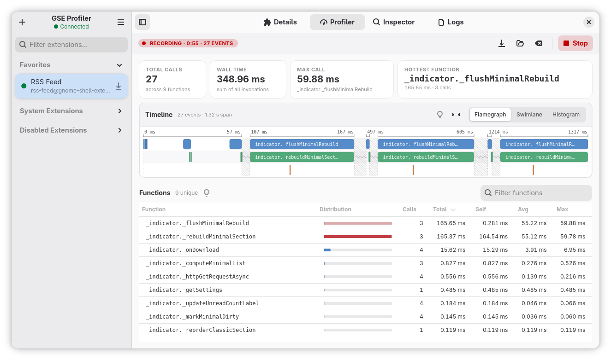
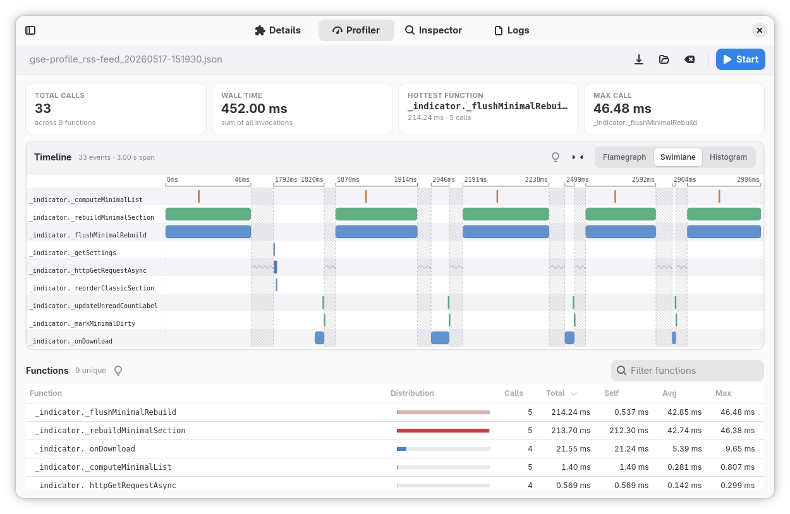
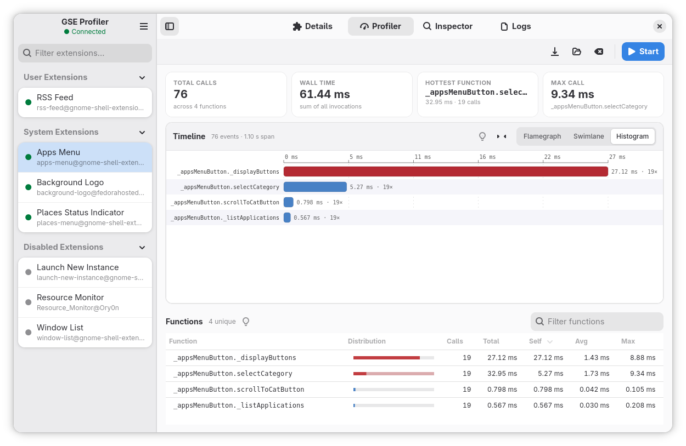
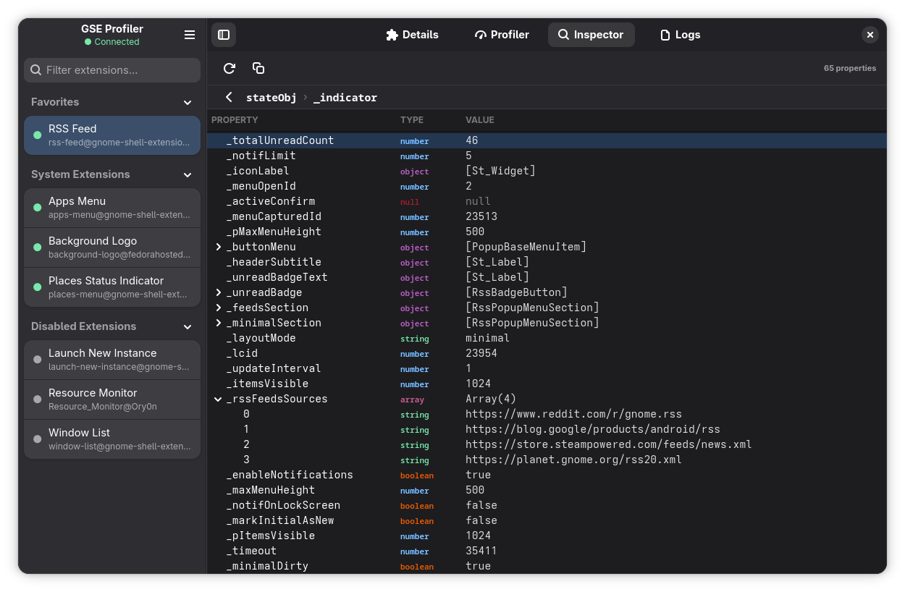
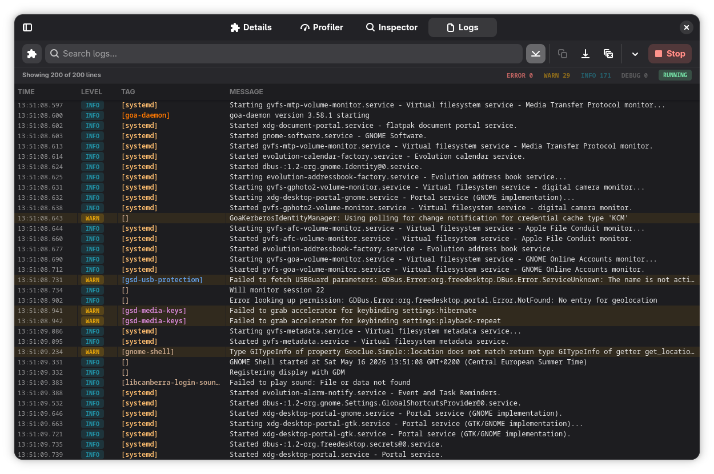

<p align="center">
  
</p>

# GSE Profiler

[](https://github.com/todevelopers/gseprofiler/actions/workflows/ci.yml)
[](https://github.com/todevelopers/gseprofiler/releases/latest)
[](LICENSE)
[](https://ko-fi.com/tommygunx89)

A developer toolkit for people who write GNOME Shell extensions. It's a native
GTK4 / libadwaita app, so it looks and behaves like the rest of your desktop instead of
some dev tool bolted on the side.

The way it works: it drops a small bridge extension into the running shell and instruments
your extension at runtime, without you touching a single line of your own code. From there
you can profile function timing and look at it as a **flamegraph** (the call tree and timing),
a **swimlane** (when and how often each function runs), or a **histogram** (where the time
actually goes). Logs get filtered down to one extension UUID so you're not digging through the
whole journal, and the inspector lets you open up any running extension object and walk its
properties, values and nested objects while it runs.

---

## Features

| Feature               | Description                                                                                                                                                 |
| --------------------- | ----------------------------------------------------------------------------------------------------------------------------------------------------------- |
| **Extension Manager** | Browse all installed extensions with status, enable/disable with one click, open the source folder directly                                                 |
| **Log Viewer**        | Live systemd journal stream. Captures the `gnome-shell` process by default (that's where all extensions actually run), with structured capture controls (scope, boot, source preset, priority) and a raw `journalctl` override when you want full control. Filter by log level, extension tag, and full-text search in real time |
| **Profiler**          | Monkey-patch any extension at runtime. No code changes needed. Visualise timing as a flamegraph, swimlane, or histogram; export and reload sessions as JSON |
| **Inspector**         | Inspect a live extension object: browse its properties and methods, see current values, and call methods interactively                                      |

---

## Keyboard Shortcuts

The two **global** shortcuts are handled inside `gnome-shell` by the bridge, so
they work even when the GSE Profiler window is not focused — handy while you
click around in the extension you're profiling. All other shortcuts are
scoped to the currently selected tab. The full list is available in-app from
the menu → **Keyboard Shortcuts** (or `Ctrl+?`).

| Shortcut          | Action                                              | Scope   |
| ----------------- | --------------------------------------------------- | ------- |
| `Super+F5`        | Toggle profiling (start / stop)                     | global  |
| `Super+Shift+F5`  | Restart profiling (stop, clear, start)              | global  |
| `Ctrl+1…4`        | Switch tab (Details / Profiler / Inspector / Logs)  | window  |
| `F9`              | Toggle the extension sidebar                         | window  |
| `Ctrl+?` / `F1`   | Show the keyboard-shortcuts dialog                   | window  |
| `Ctrl+R`          | Primary action of the tab (start-stop / refresh)    | tab     |
| `Ctrl+F`          | Focus the filter / search field                      | tab     |
| `Ctrl+S`          | Save profile / export log                            | tab     |
| `Ctrl+O`          | Load a saved profile (Profiler)                      | tab     |
| `Ctrl+L`          | Clear profiling data / log                           | tab     |

The global shortcuts register only after the bridge extension is installed and
GNOME Shell has reloaded (the usual log out / back in).

---

## How It Works

<p align="center">
  <picture>
    <source media="(prefers-color-scheme: dark)" srcset="docs/architecture-dark.svg">
    
  </picture>
</p>

There are two parts: a **GTK4 app** (Python) and a **bridge GJS extension**
(`gse-profiler-bridge@todevelopers`) that the app installs for you on first launch. The
bridge runs inside the `gnome-shell` process itself, which is what gives it direct,
in-process access to each loaded extension's live state and the objects reachable from it.

You have to restart GNOME Shell once after the bridge lands. The app just asks you to log out
and back in (Wayland only; X11 sessions aren't supported).

The main window has a live connection indicator, so you always know whether the bridge is
actually talking to the app.

### Communication

The app and bridge talk over a **Unix domain socket**
(`$XDG_RUNTIME_DIR/gse-profiler/gse-profiler.sock`) using newline-delimited JSON. The bridge
initiates the connection and reconnects automatically after a failure (3 s delay). On connect
it sends a `hello` handshake; from that point the app can start a profiling or inspection session.

Standard extension management (listing, enabling, disabling) goes through the regular
`org.gnome.Shell.Extensions` **D-Bus** interface. The socket is only there for the stuff
D-Bus is bad at: high-frequency profiling events and live inspection results. Neither path
needs elevated permissions.

### Monkey-patching and overhead

When you start profiling, the bridge takes a snapshot of the live object graph rooted at the
extension's `stateObj`. It walks methods on each object's prototype chain and recursively
follows object-valued data properties. Arrays, `Map` values, and `Set` values are traversed as
collections, so module-manager patterns such as `Map<string, Module>` are covered too. Cycle
detection and traversal safety limits keep large or self-referential graphs bounded. Getters
and arbitrary iterators are not invoked because running extension code during discovery could
have side effects.

Every method the bridge successfully wraps is **instrumented**. A method becomes **observed**
only after it is called while recording; only observed methods have timing rows in the table.
The Profiler UI shows both counts so a method that was instrumented but never exercised is not
mistaken for a discovery failure. Stop/Start keeps the observed recording until you clear it,
while the instrumented count always describes the latest discovery scan.

Discovery is a start-time snapshot. Objects, collection entries, or functions added afterwards
are not picked up automatically; restart profiling to clear the recording and scan the current
graph again. You don't change anything in your extension's source, and installed wrappers are
fully reversed when profiling stops.

Each wrapped call adds two `GLib.get_monotonic_time()` reads (microsecond precision) and
queues a timing event. The bridge sends a batch every 50 ms or when 256 events are queued,
whichever comes first, to reduce socket overhead. Batches carry a recording generation so a
late batch from before Restart cannot contaminate the fresh recording. For a typical GNOME
Shell extension the overhead is negligible, but extremely tight animation loops or extensions
that invoke hundreds of functions per frame may see a measurable slowdown during recording.

**What runtime monkey-patching cannot capture automatically:**

- GObject virtual functions (vfuncs)
- Module-level helpers, closures, and other functions held only in lexical variables
- ECMAScript `#private` methods
- Symbol-keyed methods or object-graph links
- Values hidden inside `WeakMap` or `WeakSet`, which JavaScript cannot enumerate
- Objects exposed only through getters, because discovery deliberately does not execute getters
- Constructors, `enable()`, and other calls that finished before profiling started
- Callback references that were bound or copied before their method property was wrapped
- Functions or collection entries added after the start-time snapshot (restart to rescan)
- **Async timing:** an `async` function is only recorded until it returns its `Promise`,
  usually at the first `await`. The time spent waiting, and the continuations that run after
  each `await`, don't count toward the event's duration. So async methods show their
  synchronous setup cost, not their real end-to-end latency.

### Safety recovery

Profiling only replaces functions on live JavaScript objects inside the running `gnome-shell`
process; it never modifies the target extension's files. Normally, **Stop profiling** restores
all wrappers still installed by that recording. If the app is unavailable, disabling the
**GSE Profiler Bridge** also runs its cleanup.

If the target extension still behaves unexpectedly, disable and enable it to rebuild the
runtime objects managed by its lifecycle. This is a useful first recovery step, but GNOME Shell
may reuse the extension's root instance. Logging out and back in starts a clean `gnome-shell`
process and is therefore the definitive reset for any remaining in-memory patch. Reinstalling
the target extension alone is unnecessary and does not clear JavaScript code already loaded
into the current Shell process.

### Limits

| Limit                                      | Value                         |
| ------------------------------------------ | ----------------------------- |
| Profiler: max traversal depth              | 6 (root is depth 0)           |
| Profiler: max visited objects              | 2,000                         |
| Profiler: max entries per Array/Map/Set    | 512                           |
| Profiler: max own properties per object    | 2,048                         |
| Profiler: max instrumented functions       | 5,000                         |
| Profiler: bridge event batch               | 50 ms or 256 events           |
| Max recorded events                        | 50,000 (oldest dropped first) |
| Inspector: max properties per object       | 50                            |
| Inspector: max string value length         | 200 characters                |
| Inspector: max array elements shown        | 50                            |
| Inspector: max Map entries shown            | 50                            |
| UI refresh batch window                    | 80 ms                         |

If any profiler traversal cap is reached, the bridge marks the scan as truncated and the UI
labels the instrumentation result as limited.

### Profiler views

All three views run on the same event data, they just answer different questions:

**Flamegraph.** The call tree laid out on a real-time axis. Each bar is one call, width is
duration, nesting shows caller/callee depth. Best when you want to see *what called what* and
catch call stacks that are unexpectedly deep or wide.

**Swimlane.** One horizontal lane per function, with idle gaps squeezed out. Every invocation
is its own segment on that function's row, so you can see *when and how often* a function runs
without the call-depth nesting getting in the way.

**Histogram.** Functions ranked by *self-time*, the wall-clock time spent in a function's own
code, not counting its callees. This is the fastest way to answer *where is the time actually
going?*, because it ignores time that really belongs to the callee.

---

## Gallery

<p align="center">
  <picture>
    
  </picture>
</p>

<details>
<summary><b>📸 Screenshots</b> (click to expand)</summary>

<br>







</details>

---

## Install

> Requires GNOME Shell 46+ in an active **Wayland** GNOME session.

### Option 1: Flatpak remote (recommended)

Add the self-hosted **stable** remote once, then install. You get
automatic updates with `flatpak update` from then on:

```bash
flatpak remote-add --user --if-not-exists todevelopers \
  https://todevelopers.github.io/flatpaks/todevelopers.flatpakrepo
flatpak install --user todevelopers io.github.todevelopers.GseProfiler
flatpak run io.github.todevelopers.GseProfiler
```

The remote is GPG-signed and the key is embedded in the `.flatpakrepo`
file, so no `--no-gpg-verify` is needed.

> Want early test builds (rc/beta)? Add the testing remote instead:
> `https://todevelopers.github.io/flatpaks/todevelopers-testing.flatpakrepo`

### Option 2: Flatpak bundle

Prefer a one-off install without adding a remote? Grab the `.flatpak`
bundle from the
[latest release](https://github.com/todevelopers/gseprofiler/releases/latest)
and install it (you won't get automatic updates this way):

```bash
flatpak install --user gseprofiler-*.flatpak
flatpak run io.github.todevelopers.GseProfiler
```

### Option 3: One-line source install

```bash
curl -fsSL https://raw.githubusercontent.com/todevelopers/gseprofiler/main/scripts/setup-and-run.sh | bash
```

The script checks for GTK4 / libadwaita, clones the repo to
`~/gse-profiler` and launches the app. No `sudo`, no prompts. Run the same
command again later and it pulls the latest changes and restarts the app.

### Uninstall

```bash
curl -fsSL https://raw.githubusercontent.com/todevelopers/gseprofiler/main/scripts/uninstall.sh | bash
```

Removes the app, desktop entry, icon, and bridge extension. Nothing else
on your system is touched.

---

## Requirements

- GNOME Shell 46+ (tested up to 50)
- Python 3.11+
- GTK 4 and libadwaita 1
- PyGObject (GTK4 bindings)
- `python3-systemd`, needed for the log viewer (`systemd.journal.Reader`); bundled automatically in the Flatpak

---

## Project Structure

```
gse-profiler/
├── app/                        # GTK4 Python application
│   ├── main.py
│   ├── ui/
│   │   ├── extension_manager.py
│   │   ├── extension_list.py
│   │   ├── details_view.py
│   │   ├── log_viewer.py
│   │   ├── profiler_view.py
│   │   ├── profiler/           # flamegraph, swimlane, histogram widgets
│   │   └── inspector_view.py
│   └── core/
│       ├── dbus_client.py      # D-Bus proxy for gnome-shell APIs
│       ├── socket_server.py    # Unix socket server (async)
│       ├── bridge_manager.py   # bridge install / update / hash check
│       └── journal_reader.py   # systemd journal reader (systemd.journal.Reader)
├── bridge-extension/           # GJS GNOME Shell extension
│   ├── extension.js
│   ├── profiler.js
│   ├── inspector.js
│   ├── socket_client.js
│   └── metadata.json
├── build-aux/                  # Flatpak manifest and launcher
├── data/                       # .desktop, AppStream metainfo, icons
├── docs/                       # architecture diagrams
├── scripts/                    # setup / uninstall helpers
└── tests/                      # pytest unit tests
```

---

## Contributing

See [CONTRIBUTING.md](CONTRIBUTING.md) for the full guide: development setup,
local checks, scripts and CI/release automation.

---

## Support

If you find GSE Profiler useful or it saved you some time during debugging, consider
supporting it on Ko-fi.

[](https://ko-fi.com/tommygunx89)

---

## License

GPL-3.0-or-later. See [LICENSE](LICENSE).
